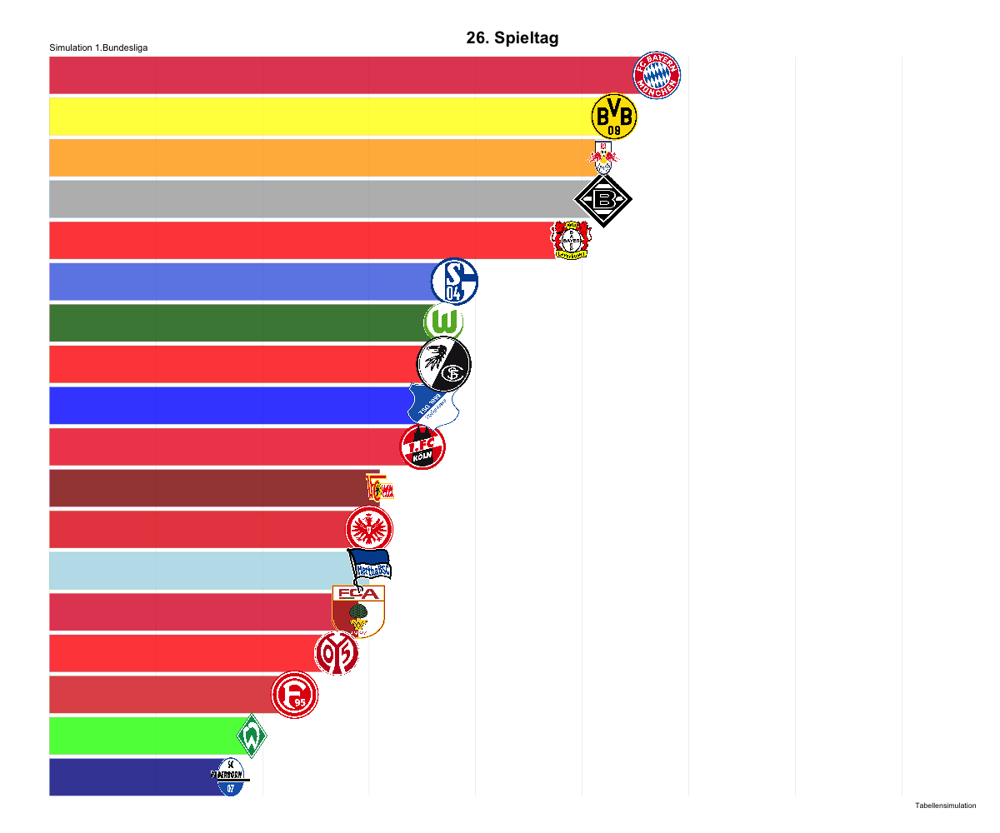

Bundesliga Simulation :bar\_chart:
================
Malte (<malte.schmielewski@goal-analytics.com>)
4/1/2020

### Simulation of the remaining Bundesliga matches and the final table

This documenent provides results of the simulation of the remaining 9
matchdays in the German Bundesliga. According to this simulation FC
Bayern München will win the cup with a chance of 63.33%. While RB
Leipzig will be second place (32.25%). Borussia Dortmund will most
likely be either second or thrid place. Bayern München, RB Leipzig,
Borussia Dortmund and Bayer Leverkusen have the highest chance to
qualify for the Champions League.

### Methods

There are 9 matchdays remaining in the Bundesliga which means there are
81 matches to be played in total. We calculated for each match
probabilities based on different distributions and simulated the outcome
20.000 times. This simulations led us to the most likely end table.

### Bundesliga Title Race

### Ligatebellen Matrix

