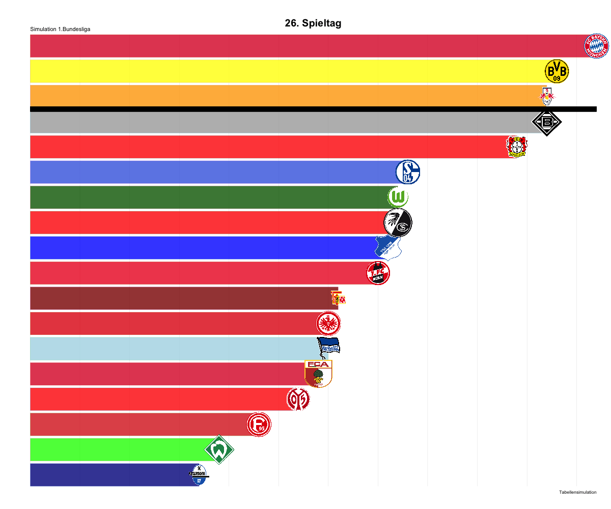

Bundesliga Simulation :bar\_chart: during the 2020 COVID-19 Break
================
Malte (<malte.schmielewski@goal-analytics.com>)
4/1/2020

During the Corona Pandemic 2020 the football world was standing still from March 2020 onwards with 9-12 matchdays left in Europes Top 5 leagues.
 I used that moment to work on a simulation to predict the season finale and the final table of each Top 5 league. All results got published through OneFootball's newsroom as well as OneFootballs Instragram Account. We released press-releases in five different languages which led some reputated and known Italian newspapers like the Gazetta and some Spanish Press to publish the model. Links to the relased can be found at the end of the blog post. In the following I will describe the method and the Tech Stack. Special Thanks to my Onefootball colleague Marc Schmidgall, who took care about the PR and published the simulation.

#### Method

The Simulation Model calculates the potential results for all remaining matches in a league based on the 10 latest home and 10 latest away matches of the two teams facing each other. Based on these past results and the teams’ relative strengths (considering input data such as goals scored/conceded, shots on target and home advantage indicator), the probabilities of each match outcome - either a win, draw or loss - are calculated using statistical distributions. Subsequently, a random generator picks an outcome for the match based on the given probabilities. Important to note: This random generator method adds the natural factor of randomness and uncertainty, which exists for each match to the model.
 This simulation is then repeated until all outstanding matches of a season are simulated. This proprietary designed “Monte-Carlo Simulation” is then run more than 155k times for each league to define the most likely final league table and the teams’ percentage chance of finishing in different positions (i.e. if Team A finishes at the top of the table in 97.500 of 150.000 simulations, the chance for Team A to win the title is 65%).

#### Tech Stack
The model is based on data from an internal MYSQL database and the model was programmed and written in R and vizualised in ggplot2.

### Press Releases

Instragram
https://www.instagram.com/p/CAFkga7qmoo/

Onefootball EN article
https://onefootball.com/en/news/onefootball-knows-how-the-premier-league-season-will-end-29904977?variable=20200513

Onefootball DE article
https://onefootball.com/de/news/onefootball-hats-berechnet-so-geht-die-bundesliga-aus-29905307?variable=20200512

Gazetta Sport article (IT)
https://www.gazzetta.it/Calcio/Serie-A/14-05-2020/and-the-winner-is-juventus-poi-barcellona-bayern-psg-liverpool-370975634218.shtml

Goal.com (SP)
https://www.goal.com/es/noticias/laliga-simulada-barcelona-campeon-espanyol-mallorca-y/1a82ugiqiihhc1two3x455w2yd

Sport.es
https://www.sport.es/es/noticias/barca/simulacion-laliga-barcelona-campeon-espanyol-mallorca-leganes-descienden-7959576

### Bundesliga Title Race

### Leaguetable Results after 20.000 Monte-Carlo Simulations

